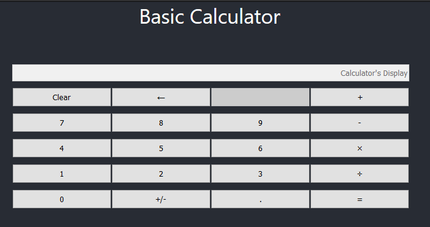
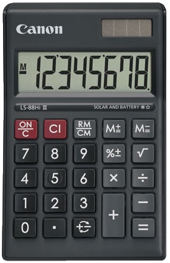

# Basic Calculator

We would like you to implement the logic for the most basic calculator.
Like one of these guys:

## Getting Started

1. Go to the folder containing the project and run `npm install`
2. To start the GUI in watch mode run `npm start`
3. The best place to start digging in the code is [App.js](src/App.js).

As for the editor, use whatever you'd like. But we use (and recommend) VS Code in our development work.

## What You Should Do
This code does not have any wiring for the logic of this calculator.
Practically, it's just plain HTML implemented with some helpful React Components.
We would like you to finish this project by adding the logic to the components and make the calculator work properly. Here is what we would like you to accomplish:

### 1) Required items
1. Every digit that is clicked should be added as the least significant digit.
2. There is no need for a cursor, nor the user should be able to place a cursor.
3. When an operator is clicked (plus, minus, etc.), you should start recording the next number if a digit is clicked.
4. Once user starts typing the next number after clicking on the operator, we should only see the next number. Imagine the most basic calculator you have ever seen.
5. If two operators are clicked back to back, the most recent operator is the one you should use.
6. For the most basic part we would like you implement the logic for these buttons:
	* the digits
	* plus operator (+)
	* minus operator (-)
	* equal sign button (=) to display the calculation result
	* decimal point (.)
	* negation (+/-)
	* clear button that resets the calculator
	* backspace (←) that deletes the least significant digit
	* **DON'T** implement multiplication/division. Those are just placeholders.

### 2) Not required but it'd be nice if you did
As mentioned above, this GUI is plain HTML and minimal CSS. We would like you to change the GUI to use [Material UI](https://material-ui.com/). Here is how to get started:
1. The necessary packages are installed. You don't need to install any packages from npm.
2. There is a sample code in [App.js](src/App.js#L16) to show you how to import Material UI and use it.
3. Look at documentation for Material UI to see samples: https://material-ui.com/components/buttons/
4. All the components you might need are in the navigation bar on the left of their website, under `Components > Input`
5. You just need to replace the basic HTML elements with their respective Material UI ones in the render functions and rewire your event handlings.
6. You might also need to change some things in [index.css](src/index.css).

### 3) In Case You have Extra Time

This is the last task: implement the logic for multiplication/division.
However, you should only do this task if you have completed the above two.
We are more interested in the above items than this one.
Be mindful of the proper order of operations.
This calculator does not support parenthesis.

## The Rules

### Don't
1. You may not install any extra npm packages or use external libraries.
2. You may not edit `index.html` file.
3. You may not use Redux.
4. You may not change the structure of the code (the folder hierarchy). The files that are there, should stay there.
5. You may not use function components and hooks. We are using class components and it should stay that way.

### Do
1. You may add new files if you need in your implementation.
2. You may add new folders under [src/](src/) if you need to organize your code.
3. You may add new styling in [index.css](src/index.css).
4. You may use tabs for indentation. This might sound unusual because most companies use spaces for indentation, but our coding convention requires use of tabs.
5. You may use/create data structures if it would help you write better code. But all the data structures you need are either built-in ES6 or you may implement them yourself.

## What We Would Like to See

1. **Do the Tasks in Order:** Don't rush through the tasks just to get all of them done. I cannot emphasize this enough. There is a reason we ordered them in this manner. We are not looking for a hastily done project. This is not an exam and there are no partial points. We are evaluating you coding practices and CS knowledge. We would like it better if you complete task 1 to perfection, but not complete task 2 or 3. Rushing through tasks is how bugs are introduced in real-life software.
2. **Bug Free Code:** Don't spend time on task 2 or 3, if your task 1 has bugs.
3. **Coding Quality:** The most important aspects to your code is its readability and maintainability. Imagine we are going to give this code to another engineer once you are done. Is it easy for that engineer to follow your code? Again, don't spend time on task 2 or 3, if your task 1 is not high quality.
4. **Code Design**: The way you design your solution impacts how scalable/future-proof your code is. Do your best.
5. **Good Coding Practices:** Use your best coding practices. I'm not going to list what I think are good practices because I would like to see what you consider good practices.
6. **Don't Steal Code:** Of course you can use stackoverflow and other online resources. We've all borrowed code snippets from stackoverflow and it's a lie if anyone says they haven't! But you should adapt what you find online to this code. Copy-pasted code stands out like a sore thumb, so there is no point in doing it.

## Submitting your final work
Once you are done, please host your code in a github repository and share the link with us.
